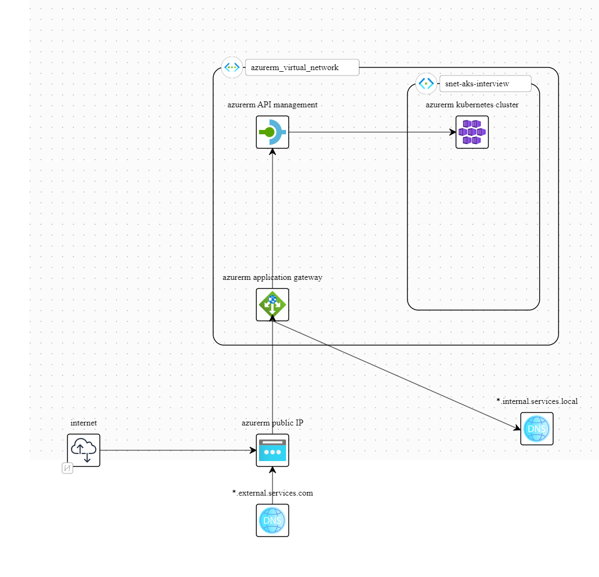

# Kubernetes Ingress / Egress

There's quite a lot of depth here, so we're going to go over the high level moving parts, and how they fit together.

This is a link to the design on a fun tool called BrainBoard [https://app.brainboard.co/a/16051912-d0de-4b76-8cf3-ba9f94f961bc/design](https://app.brainboard.co/a/16051912-d0de-4b76-8cf3-ba9f94f961bc/design), which allows you to generate Terraform from diagrams.

## Application Gateway for Kubernetes integration

We'll use this as it provides acceess to the [Application Gateway Ingress Controller](https://learn.microsoft.com/en-us/azure/application-gateway/ingress-controller-overview), which allows us to expose services from within Kubernetes into the azure control plane.

Additionally it allows us to mount both a public & private IP address, which means we can use it to expose both internal and external services.

Additionaly it can act as a Web Application Firewall, meaning that it is able to intercept requests and analyze them against a set of [OWASP rules](https://owasp.org/www-project-modsecurity-core-rule-set/). This can reduce the volume of basic attacks.

## API management for Rate limiting

This can cover off the requirements for rate limiting by IP and API key. It can be used as middleware to enforce rate limits. We can insert this in between our application gateway and our Kubernetes cluster and have it manage individual APIs or a standard strategy for everything

## ExpressRoute for on premises networking

ExpressRoute gives us a way of running a site to site VPN inside our data center that is surfaced into our azure virtual network. We deploy an express route gateway inside our network and connect to it from our on premises resources.

## Hub – Spoke Architecture for Networking

We define a hub spoke architecture for the networking. This consists of two "spoke" virtual networks. One that contains a

To avoid over-exposing the AKS and Internal networks to each other they route all intercommunication via a central "hub" network. This is a [standard network topology](https://learn.microsoft.com/en-us/azure/architecture/reference-architectures/hybrid-networking/hub-spoke?tabs=cli) suggested by Microsoft. If we decide that these two are sufficiently well coupled and we want to avoid the latency of additional hops, we might simply peer the networks.